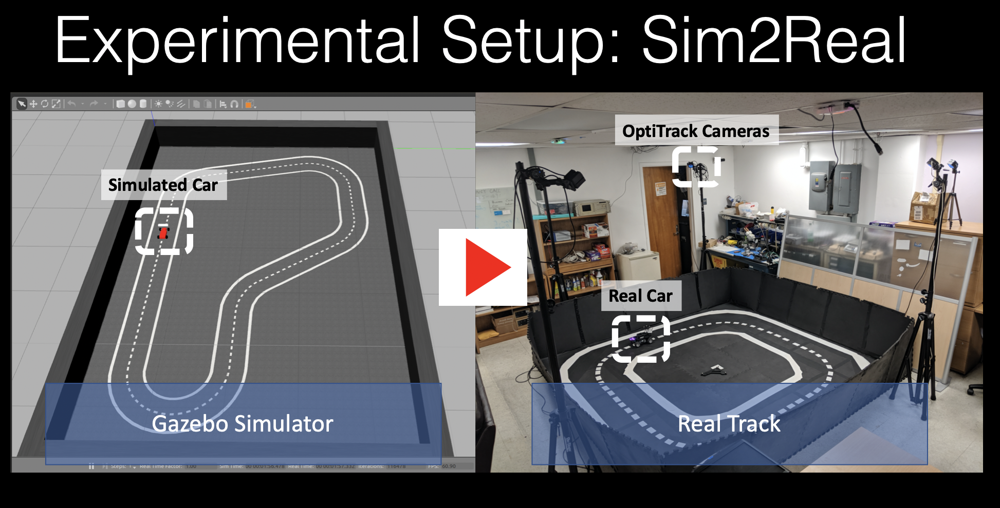

## Summary
This folder contains the code to train models for HalfCheetah, Ant, and deepracer robotic car for the paper:
*Sim2Real Transfer for Deep Reinforcement Learning with Stochastic State Transition Delays*, CORL-2020.

The paper proposes the Time-in- State RL approach, which includes delays and sampling rate as additional agent observations at training time to improve the robustness of Deep RL policies to the runtime timing variations.

**Check out the quick demo** of the transfer of policies from simulation to a real car robot.

## Code credits

a) The fully connected policy training using PPO code is taken from [open AI baselines](https://github.com/openai/baselines) with modifications done to allow
variable timing characteristics during training by fusing the delay observations with the neural network for images/state.

b) The code to train recurrent policies using PPO with variable timing characteristics is modified from the batch PPO code available [from Google-Research](https://github.com/google-research/batch-ppo).

c) The HalfCheetah environment and robot are taken from the [Pybullet](https://github.com/bulletphysics/bullet3) code with modifications for the variable timing characteristics for simulation steps.

d) The Ant environment and robot are taken from the [Pybullet](https://github.com/bulletphysics/bullet3) code with modifications for the variable timing characteristics for simulation steps.

e) Deepracer simulator modified by taking a snapshot from the open-source code of deepracer available [here](https://github.com/aws-robotics/aws-robomaker-sample-application-deepracer).
The changes include the track color, the captured camera sampling rate, and the removal of the AWS dependencies. The deepracer environment is modified to allow the variable timing characteristics.

## Requirements:
**1. Install the following requirements to train all the policies mentioned in the paper:**

a) [OpenAI gym](https://github.com/openai/gym), [OpenAI baselines](https://github.com/openai/baselines), [batch-PPO](https://github.com/google-research/batch-ppo)

b) [Gazebo and Ros](http://gazebosim.org/) for deepracer robotic car policies.

c) [Pybullet](https://github.com/bulletphysics/bullet3) for Ant and HalfCheetah

**2. To train only the fully policies only for Ant and Halfcheetah:**

a) [OpenAI gym](https://github.com/openai/gym), [OpenAI baselines](https://github.com/openai/baselines)

b) [Pybullet](https://github.com/bulletphysics/bullet3) for Ant and HalfCheetah

**3. To train only the recurrent policies for Halfcheetah:**

a) [OpenAI gym](https://github.com/openai/gym), [batch-PPO](https://github.com/google-research/batch-ppo)

b) [Pybullet](https://github.com/bulletphysics/bullet3) for HalfCheetah

**4. To train only the policies for Deepracer robotic car:**

a) [OpenAI gym](https://github.com/openai/gym), [OpenAI baselines](https://github.com/openai/baselines)

b) [Gazebo and Ros](http://gazebosim.org/) for deepracer robotic car policies.

## Usage
The training of policies, benchmarking, and visualization for each task is explained in the respective folders: 'deepracer', 'ant', 'halfcheetah', and 'halfcheetah-recurrent'.

## Questions
For any help/issue in running the code, please reachout to *sandha.iitr@gmail.com*
